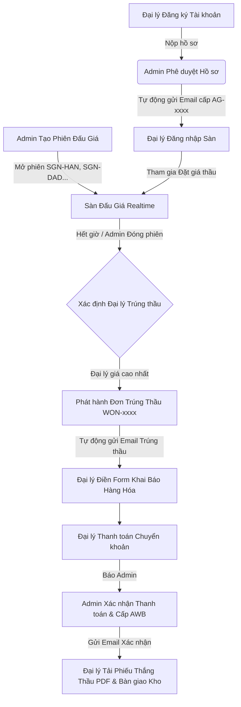

# ✈️ Vietravel Airlines Cargo Bidding Platform (VU Cargo)
> **Hệ thống Sàn Đấu Giá Tải Trọng Vận Chuyển Hàng Hóa Hàng Không Trực Tuyến**

 <!-- Optional fallback -->

---

## 📌 1. Tổng Quan Dự Án (Project Overview)

**Vietravel Airlines Cargo Bidding Platform** là hệ thống sàn đấu giá tải trọng đường hàng không trực tuyến dành cho **Vietravel Airlines** và các **Đại lý Giao nhận Vận tải (Freight Forwarders / Cargo Agents)**. 

Hệ thống cho phép hãng hàng không tối ưu hóa hiệu suất khai thác tải trọng trên từng chuyến bay (Chuyến bay chở hàng riêng biệt Cargo Aircraft cũng như bụng tàu bay thương mại Belly Cargo), đồng thời mang đến cơ hội cho các đại lý logistics đấu giá minh bạch, cạnh tranh theo thời gian thực để sở hữu slot tải trọng với chi phí tối ưu nhất.

---

## 🏗️ 2. Kiến Trúc Hệ Thống & Công Nghệ (Tech Stack & Architecture)

Hệ thống được thiết kế theo kiến trúc Web đa tầng hiện đại, mượt mà và tối ưu hiệu năng:

| Tầng / Thành phần | Công nghệ sử dụng | Mô tả chi tiết |
| :--- | :--- | :--- |
| **Frontend UI/UX** | HTML5, Vanilla CSS3, JavaScript (ES6+) | Giao diện Dark/Light Mode hiện đại, sử dụng Tailwind CSS CDN, FontAwesome 6 Icons, không phụ thuộc framework nặng. |
| **Thư viện Xuất PDF** | `html2pdf.js`, `html2canvas`, `jspdf` | Tạo và xuất Phiếu xác nhận thắng thầu & Lệnh bàn giao tải trọng chuẩn định dạng A4 PDF sắc nét, không bị trích đoạn. |
| **Backend Server** | Node.js Native HTTP Server (`server.js`) | Chạy tại cổng `8085`, xử lý Static Files, REST API RESTful endpoints, CORS, định tuyến và tích hợp Nodemailer. |
| **Cơ sở dữ liệu (Database)** | Centralized JSON DB (`server_data.json`) | Lưu trữ trạng thái phiên đấu giá, lượt đặt giá, hồ sơ đại lý, đơn trúng thầu, nhật ký email và cấu hình hệ thống. |
| **Đồng bộ Client (Store)** | `CargoStore` (`assets/js/cargo-store.js`) | Quản lý state tập trung tại client, kết hợp `LocalStorage` fallback và phát sự kiện đồng bộ đa tab (`storage` & `cargostore_updated` custom events). |
| **Dịch vụ Email (SMTP)** | Nodemailer (Gmail / Custom SMTP) | Tự động gửi email thông báo phê duyệt hồ sơ, xác nhận trúng thầu, xác nhận thanh toán real-time với định dạng HTML template thương hiệu. |

---

## 🔄 3. Tổng Quát Luồng Hoạt Động & Nghiệp Vụ (System Workflow)



### 📋 Chi Tiết Các Luồng Nghiệp Vụ Chính:

1. **Luồng 1: Đăng ký & Phê duyệt Đại lý Cargo**
   - Đại lý truy cập `Register.html` điền thông tin công ty, MST, người đại diện, email, SĐT, thiết lập Mật khẩu & Mã PIN 6 số.
   - Hệ thống ghi nhận hồ sơ ở trạng thái `PENDING` và gửi email tự động thông báo tiếp nhận.
   - Admin truy cập `Admin/04-AgentApproval.html` duyệt hồ sơ -> Hệ thống cấp Mã Đại lý dạng `AG-xxxx` và gửi Email kích hoạt tài khoản.

2. **Luồng 2: Đấu giá Tải trọng Realtime (Air Cargo Bidding) & Ẩn danh 100%**
   - Admin khởi tạo phiên đấu giá (`Admin/02-AuctionMgmt.html`) thiết lập Chuyến bay, Tuyến đường, Tải trọng (Kg), Giá khởi điểm (VND/Kg), Bước giá tối thiểu và Thời gian đếm ngược.
   - Đại lý theo dõi tại `03-Index.html` và đặt thầu tại `04-Detail.html`.
   - **Cơ chế Ẩn danh 100%**: Mọi phiếu đặt giá thầu được tự động ẩn danh tên công ty đối với các đối thủ cạnh tranh (hiển thị `Đại lý ẩn danh (AG-***)`). Đại lý chính chủ sẽ thấy nhãn `(Bạn)`, trong khi Admin giữ toàn quyền đối soát.
   - **Đồng hồ đếm ngược mượt mà (1s)**: Chuẩn hóa tần số làm tươi đếm ngược về `1000ms` (1 giây/lần), giúp các con số thời gian nhảy mượt mà từng giây.

3. **Luồng 3: Khai báo Hàng hóa (Cargo Declaration) & Kiểm định Tiêu chuẩn IATA**
   - Đại lý trúng thầu truy cập `07-WonAuction.html`.
   - **Khai báo Hồ sơ Hàng hóa**: Đại lý điền thông tin chi tiết lô hàng qua Modal (Loại hàng General/PER/VAL/DGR, Mã House AWB, Số kiện, Thể tích CBM, Shipper, Consignee, Kho đích, Yêu cầu bảo quản đặc biệt).
   - **Kiểm tra tính hợp lệ & Tiêu chuẩn IATA Air Cargo**:
     - 📌 **Trọng lượng trung bình / Kiện**: Tối thiểu $\ge 1.0\text{ Kg/kiện}$ (1.000g). Hệ thống tự động chặn các thông số phi lý như 60g/kiện (ví dụ 50.000 kiện cho 3.000 Kg).
     - 📌 **Tỷ trọng cồng kềnh (Volumetric Density) & Thể tích tối đa**: Tỷ trọng tối thiểu $\ge 20\text{ Kg/m}^3$. Thể tích tối đa cho phép được tính bằng $\text{Gross Weight} / 20$. Với $3.000\text{ Kg}$, thể tích tối đa hợp lệ là $150\text{ m}^3$. Hệ thống từ chối các khai báo cồng kềnh quá mức như $500\text{ m}^3$ ($6.0\text{ Kg/m}^3$).
     - 📌 **Tỷ trọng tối đa**: Không vượt quá $1.200\text{ Kg/m}^3$ (cảnh báo tỷ trọng quá nặng).
     - 📌 **Giới hạn tải trọng cất cánh**: Không vượt quá $100\%$ tải trọng đăng ký của chuyến bay.
     - 📌 **Thẻ Hướng dẫn & Giải thích lý do thời gian thực**: Trực tiếp giải thích nguyên nhân vi phạm và hướng dẫn điều chỉnh ngay trên giao diện Modal.
     - 📌 **Chống gõ chuỗi ngẫu nhiên (Gibberish Validation)**: Kiểm định tên mặt hàng, HAWB, Shipper/Consignee nhằm ngăn chặn việc gõ phím vô nghĩa.
   - Đại lý thực hiện thanh toán và bấm *"Tôi đã chuyển khoản"*.
   - Admin xác nhận thanh toán tại `Admin/05-AuctionDetail.html` hoặc `Admin/02-AdminDashboard.html` -> Đơn hàng chuyển sang `PAID`, hệ thống cấp mã AWB điện tử chính thức và gửi email xác nhận.
   - Đại lý Xem trước hoặc Tải về **Phiếu Xác Nhận Thắng Thầu & Lệnh Bàn Giao Tải Trọng (PDF)** đã có đầy đủ Mục IV (Thông tin Hàng hóa Khai báo) để xuất trình tại kho hàng sân bay (TCS, SCSC, ALSC...).

4. **Luồng 4: An toàn Bảo mật & Đăng xuất Thời gian thực**
   - Khi Admin thực hiện **Khóa tài khoản Đại lý** tại `Admin/06-AgentList.html`, hệ thống lập tức cập nhật trạng thái. Nếu đại lý đó đang đăng nhập sử dụng trên bất kỳ cửa sổ/tab nào, hệ thống sẽ tự động kích hoạt **Đăng xuất thời gian thực** và thông báo lý do tài khoản bị tạm khóa.

---

## 📡 4. Danh Sách Backend REST APIs (`server.js`)

Máy chủ Node.js lắng nghe tại cổng `8085` và cung cấp các Endpoints chính:

### 1. `GET /api/data`
- **Mục đích**: Lấy toàn bộ dữ liệu hệ thống từ `server_data.json` để đồng bộ về client.
- **Phương thức**: `GET`
- **Response**: JSON Object chứa `auctions`, `bids`, `wonAuctions`, `registrations`, `agentsList`, `settings`, `notifications`, `emailLogs`.

### 2. `POST /api/data`
- **Mục đích**: Cập nhật & đồng bộ dữ liệu từ client lên máy chủ trung tâm.
- **Phương thức**: `POST`
- **Request Body**: JSON Object chứa thông tin cần cập nhật (ví dụ: phiên đấu giá mới, lượt thầu mới, cập nhật hồ sơ hàng hóa, trạng thái thanh toán...).
- **Response**: `{ "success": true, "version": 1788753600000 }`

### 3. `POST /api/send-email`
- **Mục đích**: Gửi email tự động qua Nodemailer SMTP Server (Gmail SMTP / Custom Host).
- **Phương thức**: `POST`
- **Request Body**:
```json
{
  "type": "REGISTRATION_APPROVED | REGISTRATION_REJECTED | AUCTION_WON | PAYMENT_CONFIRMED | TEST_EMAIL",
  "to": "agent@example.com",
  "regData": { "companyName": "ABC Logistics", "repName": "Nguyễn Văn An" },
  "agentCode": "AG-0892",
  "wonData": { "wonId": "WON-2026-0814-01", "flightNumber": "VU130", "totalAmountVND": 66000000 }
}
```
- **Response**: `{ "success": true, "isRealSmtp": true, "messageId": "<...>", "recipient": "..." }`

---

## 🗺️ 5. Thư Mục Dự Án & Danh Sách Các Trang (Directory Structure)

```text
bidding-cargo-app/
├── 00-Home.html             # Trang chủ giới thiệu Sàn Đấu Giá Cargo
├── 01-Login.html            # Trang Đăng nhập (Phân quyền Đại lý / Admin / Staff)
├── 02-Dashboard.html        # Tổng quan thị trường & Thống kê cá nhân
├── 03-Index.html            # Sàn đấu giá chính (Bidding Hall) & Bộ lọc tuyến bay
├── 04-Detail.html           # Chi tiết phiên thầu & Đặt giá thầu Realtime
├── 05-Watchlist.html        # Danh sách các phiên thầu đang theo dõi
├── 06-MyBids.html           # Lịch sử đặt thầu của đại lý
├── 07-WonAuction.html       # Đơn thắng thầu, Form Khai báo Hàng hóa IATA & Tải PDF
├── 08-Notifications.html    # Trung tâm thông báo hệ thống
├── 09-Profile.html          # Thông tin tài khoản & Đổi mật khẩu
├── 10-Terms.html            # Điều khoản sử dụng & Quy định đấu giá
├── Register.html            # Đăng ký tài khoản Đại lý mới (Validate chuẩn)
├── assets/
│   ├── css/                 # CSS tùy biến & Style sheet
│   └── js/
│       └── cargo-store.js   # Shared Store, LocalStorage & Synchronizer Logic
├── Admin/
│   ├── 01-AdminLogin.html     # Trang Đăng nhập Quản trị viên (Admin Login)
│   ├── 02-AdminDashboard.html # Tổng quan Quản trị & Theo dõi Khai báo Hàng hóa
│   ├── 03-AuctionList.html    # Quản lý Danh sách Phiên đấu giá (Mở/Đóng phiên)
│   ├── 04-CreateAuction.html  # Khởi tạo Phiên đấu giá Tải trọng mới
│   ├── 05-AuctionDetail.html  # Chi tiết Phiên đấu giá & Quản lý Thầu / Đơn trúng
│   ├── 06-AgentList.html      # Quản lý Danh sách Đại lý (Duyệt/Khóa/Mở khóa & Auto Logout)
│   ├── 07-Reports.html        # Báo cáo Doanh thu & Thống kê Sản lượng Tải trọng
│   └── 08-Settings.html       # Cấu hình Tham số Đấu giá & SMTP Mail Server
├── scratch/
│   ├── fix_bids_data.js       # Script sinh & chuẩn hóa dữ liệu thầu ẩn danh
│   ├── test_email_send.js     # Script kiểm tra tích hợp gửi email Nodemailer SMTP
│   └── test_use_cases.js      # Script kiểm tra tự động các kịch bản nghiệp vụ (Use Cases)
├── server.js                # Node.js Server Backend API & Nodemailer SMTP Service
├── server_data.json         # Database JSON lưu trữ dữ liệu tập trung
└── README.md                # Tài liệu hướng dẫn chi tiết hệ thống
```

---

## 🚀 6. Hướng Dẫn Khởi Chạy Hệ Thống (Quick Start)

### 1. Yêu cầu môi trường:
- Đã cài đặt **Node.js** (Phiên bản 14.x trở lên).

### 2. Khởi chạy máy chủ Backend:
Mở Terminal / Command Prompt tại thư mục dự án:
```bash
# Di chuyển vào thư mục dự án
cd bidding-cargo-app

# Khởi chạy máy chủ Node.js Backend API
node server.js
```
*Máy chủ sẽ chạy tại địa chỉ:* **`http://localhost:8085/`**

### 3. Truy cập hệ thống:
Mở trình duyệt web bất kỳ (Chrome, Edge, Firefox) và truy cập:
- **Trang chủ Đại lý**: `http://localhost:8085/00-Home.html`
- **Trang Quản trị Admin**: `http://localhost:8085/Admin/01-Overview.html`

---

## 🔑 7. Tài Khoản Mẫu Trải Nghiệm (Demo Credentials)

### 👨‍💼 Tài khoản Quản trị & Nhân viên (Admin / Staff):
| Vai trò | Tên đăng nhập | Mật khẩu | Quyền hạn |
| :--- | :--- | :--- | :--- |
| **Quản trị viên (Admin)** | `admin` | `admin2026` | Toàn quyền quản trị hệ thống, duyệt đại lý, mở/đóng phiên, xác nhận tiền. |
| **Nhân viên Điều hành** | `staff01` | `staff2026` | Quản lý phiên đấu giá, theo dõi lịch sử đặt thầu. |
| **Nhân viên Thẩm định** | `staff02` | `staff2026` | Kiểm tra và xét duyệt hồ sơ đại lý mới. |

### 🚛 Tài khoản Đại lý Cargo (Freight Forwarders):
| Mã Đại lý | Tên Doanh Nghiệp | Mật khẩu | Mã PIN |
| :--- | :--- | :--- | :--- |
| **`AG-0892`** | Công ty TNHH Vận tải ABC Logistics | `abc123456` | `123456` |
| **`AG-1024`** | Công ty CP Giao nhận Kho vận Vinatrans | `vina123456` | `123456` |
| **`AG-0556`** | Công ty TNHH Tiếp vận Golden Star | `star123456` | `123456` |
| **`AG-0341`** | Công ty TNHH SkyFreight Logistics | `sky123456` | `123456` |

---

## ✉️ 8. Cấu Hình Gửi Email Thật (Real SMTP Configuration)

Hệ thống tích hợp sẵn cấu hình gửi Mail SMTP qua Nodemailer. Bạn có thể thay đổi tham số SMTP trực tiếp tại giao diện **Admin -> Cấu hình Hệ thống** (`Admin/08-Settings.html`) hoặc tạo file `.env` tại thư mục gốc:

```env
PORT=8085
SMTP_HOST=smtp.gmail.com
SMTP_PORT=465
SMTP_USER=jome7093@gmail.com
SMTP_PASS=fcjuktvwjqhgilzb
```
*Lưu ý: Mật khẩu ứng dụng Gmail (App Password) cần viết liền không khoảng cách.*

---

© 2026 **Vietravel Airlines Cargo Division**. All rights reserved.